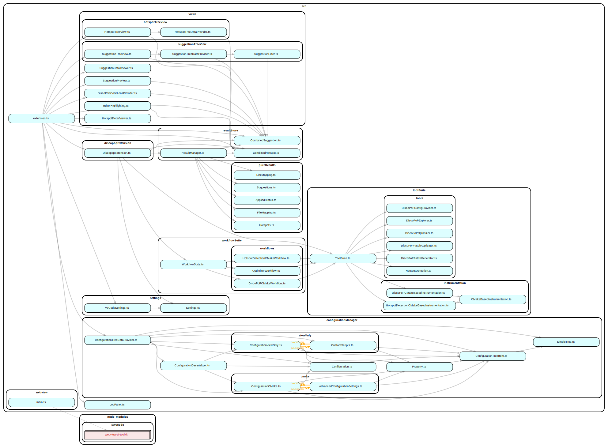

# Overview of the extension for Developers

## Environment / Prerequisites

-   nodejs 20 and npm 10 is installed
-   vscode is installed
-   The extension development is known to work well using WSL2.0 on Windows 11.
    -   Using a Linux Distribution or other Windows versions with WSL should also work, but it was not tested at the time of writing this documentation.
    -   Since the DiscoPoP tools do not support Windows anyways, no measures were taken to explicitly support pure Windows (without WSL) environments, though in theory it should be possible.

## Installation

-   Clone the repository (e.g. inside WSL: `git clone git@github.com:discopop-project/discopop-gui-vscode.git`)
-   Open the directory in vscode (e.g. `code .` while being in the root directory)
-   run `npm install` in the root directory of the project.

**NOTE:** During the installation git hooks will be created to automatically format the source code in pre-commit hooks using [husky](https://typicode.github.io/husky/). The hooks also enforce the use of [conventional commits](https://www.conventionalcommits.org/en/v1.0.0/)

## Running

Press F5 to start the extension in debug mode.

**Tip**: The debugging support of vs code is quite good: Set breakpoints and then inspect values while stepping through the program.

**TIP**: There is a bug in the vscode typescript support. Moving files sometimes crashes the internal typescript server which results in problems being reported. Hit CTR + SHIFT + P and then run the "restart typescript server" command. (Alternatively close and reopen vs code or make changes to tsconfig.json (and undo them), both results in the typescript server being restarted)

### Helpful resources

-   Icons:
    -   https://microsoft.github.io/vscode-codicons/dist/codicon.html
    -   https://code.visualstudio.com/api/references/icons-in-labels#icon-listing
-   API Documentation:
    -   https://code.visualstudio.com/api
-   Webview UI Toolkit:
    -   https://github.com/microsoft/vscode-webview-ui-toolkit/blob/main/docs/getting-started.md

### Creating Releases

-   update the version in package.json
-   run `npm install` to update the package-lock.json as well
-   update the CHANGELOG.md
-   update the README.md compatibility table
-   commit these changes and push them to github
-   create a release using the github user interface

## Dependency-Graph

Sometimes it is helpful to see dependencies between source files. You can use [dependency-cruiser](https://github.com/sverweij/dependency-cruiser) to create text or graph representations of all dependencies. `npm run depcruise` will create an overview in `dependency-graph.svg`. Requires graphviz to be installed! (`sudo apt install graphviz`)

When git hooks are installed and working, then the file will be updated during a commit (but not added to version control, thats up to you)

